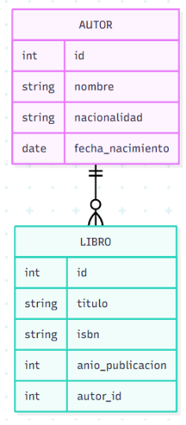

# Biblioteca API

## Descripción

API REST desarrollada con Django REST Framework para la gestión de autores y libros.

## Tecnologías utilizadas

* Python
* Django
* Django REST Framework
* PostgreSQL
* Docker Compose
* drf-spectacular
* django-filter
* django-cors-headers

## Modelo de Datos

### Diagrama Entidad-Relación

Inserta aquí la imagen de tu diagrama.

Ejemplo:



## Levantar la Base de Datos

Ejecutar Docker:

```bash
docker compose up -d
```

Verificar contenedores:

```bash
docker ps
```

## Ejecutar Migraciones

```bash
python manage.py makemigrations
python manage.py migrate
```

## Ejecutar Servidor

```bash
python manage.py runserver
```

## Swagger

Disponible en:

http://127.0.0.1:8000/swagger/

## Filtros

Obtener todos los libros:

GET /api/libros/

Filtrar por autor:

GET /api/libros/?autor=1

Filtrar por año:

GET /api/libros/?anio_publicacion=2024

## Cliente Python

Para probar la API:

```bash
python cliente_api.py
```
